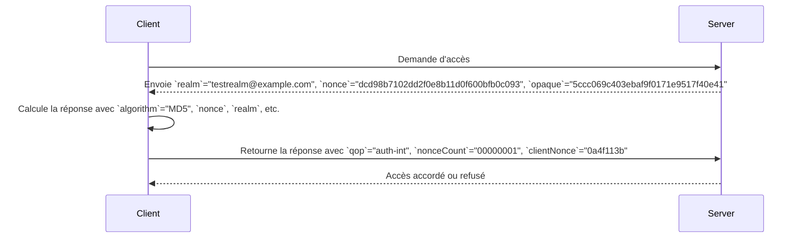

# Test du mode d'authentification Digest

**Authentification Digest :**
- L’authentification Digest est un mécanisme utilisé pour sécuriser les communications sur Internet.
  
- Contrairement à l’authentification de base, où le nom d’utilisateur et le mot de passe sont envoyés en texte clair, l’authentification Digest demande au client d’envoyer un hachage de ses informations sur le canal de communication. Ainsi, le nom d’utilisateur et le mot de passe du client ne sont jamais transmis en clair sur le réseau1.
  
- L’authentification Digest fonctionne bien sur Internet, ce qui la rend plus appropriée que l’authentification Windows1.

  ### Mécanisme d'Authentification Digest : Éléments, Rôles et Exemples

- **Realm** (Obligatoire)
  - **Rôle** : Identifie l'espace de protection auquel l'utilisateur essaie d'accéder.
  - **Exemple de valeur** : `"testrealm@example.com"`
  - **Explication** : Indique que l'utilisateur doit s'authentifier pour accéder aux ressources du domaine `example.com`.

- **Nonce** (Obligatoire)
  - **Rôle** : Valeur unique générée par le serveur pour chaque demande, utilisée pour prévenir les attaques par rejeu.
  - **Exemple de valeur** : `"dcd98b7102dd2f0e8b11d0f600bfb0c093"`
  - **Explication** : Cette valeur unique garantit que chaque demande d'authentification est unique.

- **Algorithm** (Obligatoire)
  - **Rôle** : Méthode de hachage utilisée pour sécuriser le mot de passe.
  - **Exemple de valeur** : `"MD5"`
  - **Explication** : Définit l'algorithme de hachage utilisé pour sécuriser les informations, ici `MD5`.

- **qop** (Optionnel)
  - **Rôle** : Spécifie le type de protection utilisé (par exemple, authentification seule ou authentification avec intégrité).
  - **Exemple de valeur** : `"auth-int"`
  - **Explication** : Indique que l'intégrité des messages est vérifiée en plus de l'authentification (`auth-int`).

- **Nonce Count** (Optionnel)
  - **Rôle** : Compteur des nonces utilisés par le client dans les requêtes successives.
  - **Exemple de valeur** : `"00000001"`
  - **Explication** : Ce compteur indique que c'est la première utilisation de ce nonce.

- **Client Nonce** (Optionnel)
  - **Rôle** : Valeur unique générée par le client pour améliorer la sécurité contre les attaques par rejeu.
  - **Exemple de valeur** : `"0a4f113b"`
  - **Explication** : Ce nonce est utilisé par le client pour ajouter une couche supplémentaire de sécurité.

- **Opaque** (Optionnel)
  - **Rôle** : Valeur opaque renvoyée par le serveur et retournée par le client pour maintenir l'état entre les requêtes.
  - **Exemple de valeur** : `"5ccc069c403ebaf9f0171e9517f40e41"`
  - **Explication** : Cette valeur est renvoyée par le serveur pour s'assurer que la même session est utilisée entre le client et le serveur.


### Diagramme de Séquence 



Ces exemples montrent comment les éléments du mécanisme d'authentification Digest sont utilisés pour sécuriser les échanges entre le client et le serveur, en protégeant contre les attaques par rejeu et en maintenant la cohérence de la session d'authentification.

## Création du serveur web api 

- Ouvrez Visual Studio ou votre éditeur de code préféré.

- Créez un nouveau projet ASP.NET Core Web API en sélectionnant le modèle approprié.

Ajouter la classe ***User*** 

```CSharp 
public class User
{
    public string Username { get; set; }
    public string Password { get; set; }
}

```
Et puis la classe ***DigestAuthenticationMiddleware***

Cette classe intercepte les requêtes pour vérifier les utilisateurs est ce qu'il font partie des utilisateurs authentifiés ou pas

```CSharp 
public class DigestAuthenticationMiddleware
{
    private readonly RequestDelegate _next;
    private readonly IList<User> _users;
    private readonly ILogger<DigestAuthenticationMiddleware> _logger;
    private const string Realm = "MyRealm";

    public DigestAuthenticationMiddleware(RequestDelegate next, IOptions<List<User>> users, ILogger<DigestAuthenticationMiddleware> logger)
    {
        _next = next;
        _users = users.Value;
        _logger = logger;
    }

    public async Task InvokeAsync(HttpContext context)
    {
        if (!context.Request.Headers.ContainsKey("Authorization"))
        {
            await Challenge(context);
            return;
        }

        var authHeader = context.Request.Headers["Authorization"].ToString();
        _logger.LogInformation("Authorization Header: {authHeader}", authHeader);

        if (authHeader.StartsWith("Digest ", StringComparison.OrdinalIgnoreCase))
        {
            var digestValues = ParseDigestHeader(authHeader);
            if (digestValues != null && IsValidDigest(digestValues, context))
            {
                _logger.LogInformation("Digest is valid.");
                await _next(context);
                return;
            }
        }

        _logger.LogWarning("Unauthorized request.");
        context.Response.StatusCode = StatusCodes.Status401Unauthorized;
        await Challenge(context);
    }

    private async Task Challenge(HttpContext context)
    {
        var nonce = GenerateNonce();
        _logger.LogInformation("Generated nonce: {nonce}", nonce);

        context.Response.Headers["WWW-Authenticate"] = $"Digest realm=\"{Realm}\", nonce=\"{nonce}\", qop=\"auth\"";
        context.Response.StatusCode = StatusCodes.Status401Unauthorized;
        await context.Response.WriteAsync("Unauthorized");
    }

    private string GenerateNonce()
    {
        var nonceBytes = new byte[16];
        using (var rng = RandomNumberGenerator.Create())
        {
            rng.GetBytes(nonceBytes);
        }
        return Convert.ToBase64String(nonceBytes);
    }

    private IDictionary<string, string> ParseDigestHeader(string authHeader)
    {
        var values = new Dictionary<string, string>(StringComparer.OrdinalIgnoreCase);
        var pairs = authHeader.Substring(7).Split(',');

        foreach (var pair in pairs)
        {
            var keyValue = pair.Split(new[] { '=' }, 2);
            if (keyValue.Length == 2)
            {
                var key = keyValue[0].Trim(' ', '"');
                var value = keyValue[1].Trim(' ', '"');
                values[key] = value;
            }
        }

        foreach (var kvp in values)
        {
            _logger.LogInformation("Digest Header: {Key} = {Value}", kvp.Key, kvp.Value);
        }

        return values;
    }

    private bool IsValidDigest(IDictionary<string, string> digestValues, HttpContext context)
    {
        var username = digestValues["username"];
        var user = _users.FirstOrDefault(u => u.Username == username);

        if (user == null)
        {
            _logger.LogWarning("User not found: {username}", username);
            return false;
        }

        var realm = digestValues["realm"];
        var nonce = digestValues["nonce"];
        var uri = digestValues["uri"];
        var qop = digestValues["qop"];
        var nc = digestValues["nc"];
        var cnonce = digestValues["cnonce"];
        var response = digestValues["response"];
        var method = context.Request.Method;

        // HA1 = MD5(username:realm:password)
        var ha1 = CalculateMD5Hash($"{username}:{realm}:{user.Password}");

        // HA2 = MD5(method:digestURI)
        var ha2 = CalculateMD5Hash($"{method}:{uri}");

        // response = MD5(HA1:nonce:nc:cnonce:qop:HA2)
        var validResponse = CalculateMD5Hash($"{ha1}:{nonce}:{nc}:{cnonce}:{qop}:{ha2}");

        _logger.LogInformation("Calculated HA1: {ha1}", ha1);
        _logger.LogInformation("Calculated HA2: {ha2}", ha2);
        _logger.LogInformation("Calculated response: {validResponse}", validResponse);
        _logger.LogInformation("Client response: {response}", response);

        return validResponse.Equals(response, StringComparison.OrdinalIgnoreCase);
    }

    private string CalculateMD5Hash(string input)
    {
        using (var md5 = MD5.Create())
        {
            var inputBytes = Encoding.ASCII.GetBytes(input);
            var hashBytes = md5.ComputeHash(inputBytes);
            var sb = new StringBuilder();
            foreach (var b in hashBytes)
            {
                sb.Append(b.ToString("x2"));
            }
            return sb.ToString();
        }
    }
}

```

- Ajoutez des paramètres d'accès des utilisateurs dans le fichier ***appsettings.json***

``` Json
{
  "Logging": {
    "LogLevel": {
      "Default": "Information",
      "Microsoft.AspNetCore": "Warning"
    }
  },
    "Users": [
      {
        "Username": "user1",
        "Password": "password1"
      },
      {
        "Username": "user2",
        "Password": "password2"
      }
    ]
  ,
  "AllowedHosts": "*"
}

```
- Tester le code avec un contrôleur ***TestController***

``` CSharp
using Microsoft.AspNetCore.Authorization;
using Microsoft.AspNetCore.Mvc;

namespace WebAuthDigest2.Controllers
{
    [Route("api/[controller]")]
    [ApiController]
    public class TestController : ControllerBase
    {
        public IActionResult Get()
        {
            return Ok("You're authenticated");
        }
    }
}

```

## Test du service dans Postman 


Voici les valeurs possibles que vous pouvez spécifier pour chaque champ dans l’authentification Digest de Postman :

- ***Username (Nom d’utilisateur) :*** Vous pouvez entrer le nom d’utilisateur associé à l’authentification.
- ***Password (Mot de passe) :*** Entrez le mot de passe correspondant au nom d’utilisateur.
- ***Realm (Royaume) :*** Cela dépend du serveur, mais vous pouvez spécifier une chaîne comme “Mon Royaume” ou “Zone de protection”.
- ***Nonce (Nombre à usage unique) :*** Le serveur génère une valeur unique pour chaque demande. Vous pouvez simplement laisser ce champ vide, et Postman le gérera automatiquement.
- ***Algorithm (Algorithme) :*** Vous pouvez spécifier MD5 ou SHA, en fonction des exigences du serveur.
- ***qop (Qualité de protection) :*** Si le serveur le demande, vous pouvez spécifier “auth” ou “auth-int”.
- ***Nonce Count (Compteur de nombre à usage unique) :*** Vous pouvez entrer un nombre hexadécimal, par exemple, “00000001”.
- ***Client Nonce (Nonce du client) :*** Vous pouvez spécifier une chaîne aléatoire, par exemple, “0a4f113b”.
- ***Opaque :*** Lasser vide.

)


  
  
  

